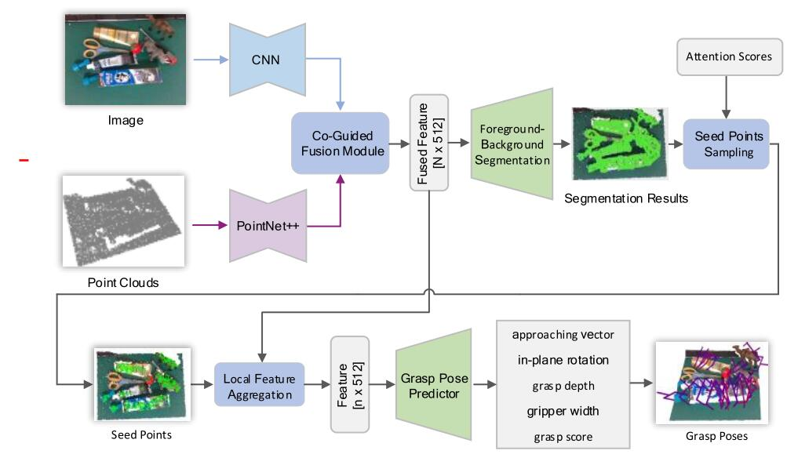

# MMF-Net
"Joint Segmentation and Grasp Pose Detection with Multi-Modal Feature Fusion Network" (ICRA 2023)

[[dataset](https://graspnet.net/)]
[[API](https://github.com/graspnet/graspnetAPI)]
[[doc](https://graspnetapi.readthedocs.io/en/latest/index.html)]



## Update
In this repository, we have optimized the code to run on lower memory (12G is enough, Batch_size = 2), by downsampling the point clouds, reducing the image size, replacing and simplifying the feature extraction network, optimizing the grasp parameter predictors, etc. These optimizations have improved the computational efficiency and model performance.

## Requirements
- Python 3
- PyTorch 1.6
- Open3d >=0.8
- TensorBoard 2.3
- NumPy
- SciPy
- Pillow
- tqdm
- MinkowskiEngine

## Installation
Get the code.
```bash
git clone https://github.com/xiaozheng-liu/MMF-Net.git
cd MMF-Net
```
Install packages via Pip.
```bash
pip install -r requirements.txt
```
Compile and install pointnet2 operators (code adapted from [votenet](https://github.com/facebookresearch/votenet)).
```bash
cd pointnet2
python setup.py install
```
Compile and install knn operator (code adapted from [pytorch_knn_cuda](https://github.com/chrischoy/pytorch_knn_cuda)).
```bash
cd knn
python setup.py install
```
Install graspnetAPI for evaluation.
```bash
git clone https://github.com/graspnet/graspnetAPI.git
cd graspnetAPI
pip install .
```
For MinkowskiEngine, please refer https://github.com/NVIDIA/MinkowskiEngine

## Training and Testing
Training examples are shown in [command_train.sh](command_train.sh). `--dataset_root`, `--camera` and `--log_dir` should be specified according to your settings. You can use TensorBoard to visualize training process.

Testing examples are shown in [command_test.sh](command_test.sh), which contains inference and result evaluation. `--dataset_root`, `--camera`, `--checkpoint_path` and `--dump_dir` should be specified according to your settings. Set `--collision_thresh` to -1 for fast inference.


## Results
Results "In repo" report the model performance after code optimization. All results are without collision detection.

Evaluation results on RealSense camera:
|          |        | Seen             |                  |        | Similar          |                  |        | Novel            |                  | 
|:--------:|:------:|:----------------:|:----------------:|:------:|:----------------:|:----------------:|:------:|:----------------:|:----------------:|
|          | __AP__ | AP<sub>0.8</sub> | AP<sub>0.4</sub> | __AP__ | AP<sub>0.8</sub> | AP<sub>0.4</sub> | __AP__ | AP<sub>0.8</sub> | AP<sub>0.4</sub> |
| In paper | 36.29  | 44.51            | 29.73            | 30.52  | 36.57            | 23.36            | 15.34  | 18.24            | 6.85             |
| __In repo__  | 67.73  | 79.78            | 61.47            | 57.58  |      70.63     |      47.90  | 23.40  |    29.61    |   11.96               |

## Additional Comparative Experiments
To evaluate the effect of the image stream, we performed algorithm experiments with only point cloud input, using PointNet++ backbone network and ResUNet14 based on MinkowskiEngine. The experimental results are as follows:
|          |        | Seen             |                  |        | Similar          |                  |        | Novel            |                  | 
|:--------:|:------:|:----------------:|:----------------:|:------:|:----------------:|:----------------:|:------:|:----------------:|:----------------:|
|          | __AP__ | AP<sub>0.8</sub> | AP<sub>0.4</sub> | __AP__ | AP<sub>0.8</sub> | AP<sub>0.4</sub> | __AP__ | AP<sub>0.8</sub> | AP<sub>0.4</sub> |
| PointClouds(PointNet++) | 57.98  |        70.41    |   47.89     | 50.16  |     62.88   |      38.19   | 21.58  |      27.29    |     9.63      |
| PointClouds(ResUNet14)  |  62.75   |     75.82     | 53.31  |     53.97     |      __67.12__     | 42.87 |      __23.09__        |      __29.16__      |  10.85|
| DenseFusion  |  63.23  | 75.99            | 53.94            | 53.39  |      66.23     |      42.11   | 22.22  |    28.22    |   10.66               |
| Ours  |  __64.52__  | __76.96__      | __56.60__     | __54.13__  |   66.83 |  __43.52__   | 22.65  |    28.07    |   __10.99__               |

Note that the similarity between the 256 sets of data for each scene is very high. In order to save computing resources, the above results are obtained by selecting only one-third of the data of each scene for training.

Also, for a fair comparison, we have trained following the settings in Graspsess(ICCV 2021), with all data of 100 scenes participating in the training, and batch_size=4，epoch=10. All results are without collision detection. Evaluation results on RealSense camera:
|          |        | Seen             |                  |        | Similar          |                  |        | Novel            |                  | 
|:--------:|:------:|:----------------:|:----------------:|:------:|:----------------:|:----------------:|:------:|:----------------:|:----------------:|
|          | __AP__ | AP<sub>0.8</sub> | AP<sub>0.4</sub> | __AP__ | AP<sub>0.8</sub> | AP<sub>0.4</sub> | __AP__ | AP<sub>0.8</sub> | AP<sub>0.4</sub> |
|  Graspsess(ICCV 2021) | 65.70  | 76.25           | 61.08            | 53.75  | 65.04            | 45.97            | __23.98__  | __29.93__            | __14.05__             |
| __In repo__  | __67.73__  | __79.78__            | __61.47__            | __57.58__  |      __70.63__     |      __47.90__   | 23.40  |    29.61    |   11.96               |

In addition, the results of collision detection are as follows:
|          |        | Seen             |                  |        | Similar          |                  |        | Novel            |                  | 
|:--------:|:------:|:----------------:|:----------------:|:------:|:----------------:|:----------------:|:------:|:----------------:|:----------------:|
|          | __AP__ | AP<sub>0.8</sub> | AP<sub>0.4</sub> | __AP__ | AP<sub>0.8</sub> | AP<sub>0.4</sub> | __AP__ | AP<sub>0.8</sub> | AP<sub>0.4</sub> |
|  Ours+CD  | 70.42 | 83.23           | 63.18          | 60.42  |74.29          | 49.60           | 25.22  | 31.83           | 12.49             |


The pretrained weights can be downloaded from:
https://pan.baidu.com/s/16VSa2mdwl0B2QVoGvPd2gQ    code: yfbm

## Acknowledgement
- https://github.com/graspnet/graspnet-baseline
- https://github.com/rhett-chen/graspness_implementation
- https://github.com/ethnhe/FFB6D
- https://github.com/j96w/DenseFusion
